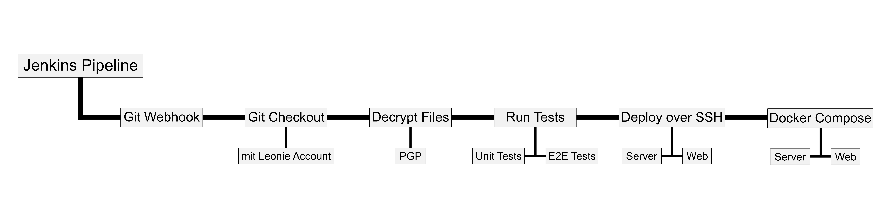

# [Jenkins](https://jenkins.vm81.htl-leonding.ac.at)

## Was macht Jenkins?

Codeänderungen werden sofort automatisch getestet und auf die Systeme deployed.

## Aufsetzen

Eine neue Pipeline wird mit "Element anlegen" angelegt.

Danach muss man einen Namen angeben und "Pipeline" auswählen.

Unter "General" wird "GitHub-Projekt" angehakt und als Project url wird die URL zum GitHub Repository angegeben.

Weiters muss "GitHub hook trigger for GITScm polling" angehakt werden.

Unter "Pipeline" wird "Pipeline script from SCM" als Definition ausgewählt. Als SCM wird Git ausgewählt.

Die Repository URL ist die Remote URL des GitHub Repositories und die Credentials sind `htl-leonding-jenkins/******`.

Als Branch Specifier wird der Branch ausgewählt, der den Code enthält, der gebuildet werden soll.

Mit "Speichern" wird die Pipeline gespeichert.

Auf GitHub wird unter Settings > Webhooks der Webhook hinzugefügt.

Die Payload URL ist `[Jenkins URL]/github-webhook/`. Danach wird "Send me **everything**"  ausgewählt und auf "Add webhook" geklickt.

## Konfiguration

Unter "Konfigurieren" können die aktuellen Einstellungen geändert werden.

## [Jenkinsfile](https://github.com/htblaleonie/leonie-web/blob/dev/Jenkinsfile)

Am Anfang des Jenkinsfiles wird der `agent` definiert. Dieser ist eine Maschine oder ein Container, der die Pipeline ausführt. `any`, bedeutet, dass sie auf jeder verfügbaren Maschine ausgeführt werden kann.

Danach werden die Environment-Variablen definiert. Diese Variablen können im gesamten Jenkinsfile verwendet werden.

In der Variable `GPG_PASSWORD` werden von Jenkins gespeicherte Credentials gespeichert.

Danach werden die Stages definiert. Es gibt die Stages `Build`, `Test`, und `Deploy`. Jede Stage besteht aus Steps. In diesen können z.B. Shell-Befehle ausgeführt werden.

Stages bei Leonie:

- **Build**: Dateien decrypten
- **Test**: Noch nicht implementiert
- **Deploy**: Über `ssh` deployen

Unter `post` kann man definieren, was nach den Stages ausgeführt wird. Bei Leonie wird mit `cleanWs()` der Workspace aufgeräumt.